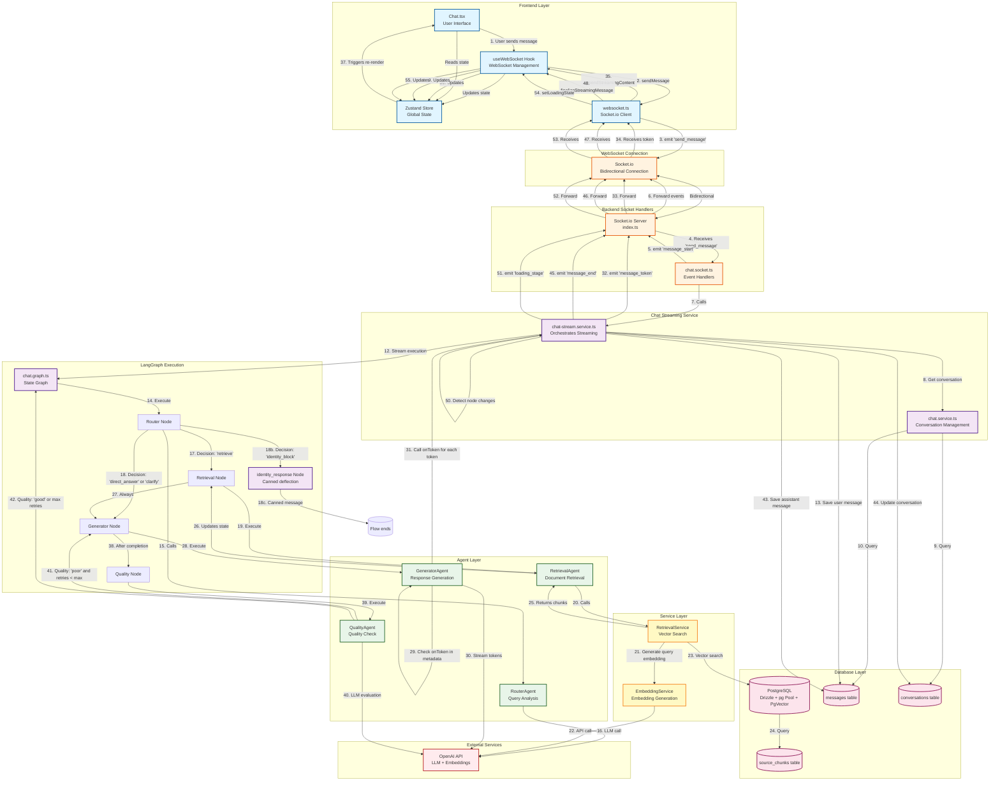

# Cognifast AI - Architecture Flow Diagram

This document provides a comprehensive visual representation of how services and sockets interact in the Cognifast AI application.

## Complete System Flow

## Detailed Component Interactions

### 1. Message Sending Flow (Steps 1-12)

**User Action → Frontend → WebSocket → Backend**

1. User types message in `Chat.tsx`
2. `handleSendMessage()` calls `sendMessageViaWebSocket()` from `useWebSocket` hook
3. Hook emits `send_message` event via Socket.io client
4. Backend `chat.socket.ts` receives event
5. Socket handler emits `message_start` event to frontend
6. Socket handler calls `streamChatGraphWithWebSocket()`
7. Service fetches conversation data from database
8. Service saves user message to database
9. Service creates `onToken` callback for streaming
10. Service initializes LangGraph state with callback in metadata
11. Service starts streaming graph execution

### 2. LangGraph Execution Flow (Steps 13-42)

**Router → Retrieval (conditional) / Generator / identity_response (conditional) → Generator → Quality → End/Retry**

13. **Router Agent** (`router.agent.ts`):
    - Analyzes user query using OpenAI GPT-4o-mini
    - Returns one of four decisions: `'retrieve'`, `'direct_answer'`, `'clarify'`, or `'identity_block'`
    - If `'retrieve'`: routes to Retrieval Node
    - If `'direct_answer'` or `'clarify'`: routes directly to Generator Node
    - If `'identity_block'`: routes to `identity_response` node (canned deflection message, then END; no quality check)

14. **Retrieval Agent** (`retrieval.agent.ts`) - Only if router decision is `'retrieve'`:
    - Calls `RetrievalService.retrieveRelevantChunks()`
    - RetrievalService calls `EmbeddingService.generateQueryEmbedding()`
    - EmbeddingService calls OpenAI API for query embedding
    - RetrievalService performs vector search in PostgreSQL using `match_sources_chunks` RPC
    - Returns top 5 relevant chunks with similarity scores
    - Updates state with retrieved chunks

15. **Generator Agent** (`generator.agent.ts`):
    - Checks if `onToken` callback exists in state metadata
    - If yes: Uses `llm.stream()` for token-by-token streaming
    - Calls `onToken(token)` for each token received from OpenAI
    - If no: Uses `llm.invoke()` for non-streaming (REST API compatibility)
    - Creates assistant message with complete content
    - Includes sources from retrieved chunks (if any)

16. **Quality Agent** (`quality.agent.ts`):
    - Evaluates response quality using OpenAI GPT-4o-mini
    - Returns `'good'` or `'poor'`
    - If `'poor'` and `retryCount < 2`: routes back to Generator Node
    - If `'good'` or `retryCount >= 2`: routes to END

### 3. Streaming Flow (Steps 31-49)

**Token-by-Token Streaming Back to Frontend**

31. Generator agent calls `onToken(token)` for each token
32. `onToken` callback in `chat-stream.service.ts` immediately emits `message_token` event
33. Socket.io server forwards event to connected client
34. Frontend `useWebSocket` hook receives `message_token` event
35. Hook calls `appendStreamingContent()` to update Zustand store
36. Store update triggers re-render in `Chat.tsx`
37. UI displays streaming tokens in real-time

### 4. Loading States Flow (Steps 50-55)

**Stage-Specific Loading Messages**

50. `chat-stream.service.ts` monitors graph execution state
51. Detects when current node changes (router → retrieval → generator)
52. Emits `loading_stage` event with stage name and message:
    - `router`: "Looking for cues..."
    - `retrieval`: "Reviewing document..."
    - `generator`: "Generating response..."
53. Frontend receives `loading_stage` event
54. Hook calls `setLoadingState()` to update Zustand store
55. UI displays modern gradient spinner with italicized stage message

### 5. Finalization Flow (Steps 43-49)

**Message Completion and Persistence**

43. After graph execution completes, `chat-stream.service.ts` saves final assistant message to database
44. Updates conversation `updated_at` timestamp
45. Emits `message_end` event with complete message object
46. Frontend receives `message_end` event
47. Hook calls `finalizeStreamingMessage()` to convert streaming content to final message
48. Store updates with complete message
49. UI displays final message with proper formatting

## Key Design Patterns

### 1. **Optimistic UI Updates**
- Frontend immediately adds user message to Zustand store before sending
- Provides instant feedback to user
- Reverts on error

### 2. **Token-by-Token Streaming**
- `onToken` callback passed through LangGraph state metadata
- Allows immediate emission of tokens without waiting for complete response
- Provides real-time feedback during generation

### 3. **Conditional Routing**
- Router agent decides execution path based on query analysis
- Retrieval only happens when needed
- Reduces latency for simple queries

### 4. **Quality Assurance Loop**
- Quality agent evaluates responses
- Automatic retry mechanism for poor quality responses
- Prevents infinite loops with max retry limit

### 5. **State Management**
- Zustand store maintains global state
- Messages persist across component re-renders
- Real-time updates via WebSocket events

## Database Schema Interactions

### Messages Table
- **Insert**: User messages (step 13), Assistant messages (step 43)
- **Select**: Conversation history for context (step 8)

### Conversations Table
- **Select**: Conversation details and document IDs (step 8)
- **Update**: `updated_at` timestamp on new messages (step 44)

### Source Chunks Table
- **Select**: Vector search via `match_sources_chunks` RPC (step 23)
- **Filter**: By source IDs associated with conversation

## WebSocket Events

### Client → Server
- `join_conversation`: Join conversation room
- `send_message`: Send user message
- `leave_conversation`: Leave conversation room

### Server → Client
- `joined_conversation`: Confirmation of room join
- `message_start`: Streaming started
- `loading_stage`: Stage-specific loading message
- `message_token`: Individual token from streaming response
- `message_end`: Streaming complete with final message
- `error`: Error occurred during processing

## Error Handling

- **Connection Errors**: Socket.io automatically reconnects
- **Processing Errors**: Emitted as `error` events to frontend
- **Database Errors**: Logged and propagated to frontend
- **API Errors**: Handled in respective agents/services

## Performance Optimizations

1. **First Message Skip**: Quality check skipped for first message to improve response time
2. **Conditional Retrieval**: Only retrieves when router determines it's needed
3. **Streaming**: Token-by-token streaming provides immediate feedback
4. **Connection Reuse**: Single Socket.io connection per client
5. **Room-Based Broadcasting**: Messages only sent to relevant conversation rooms

